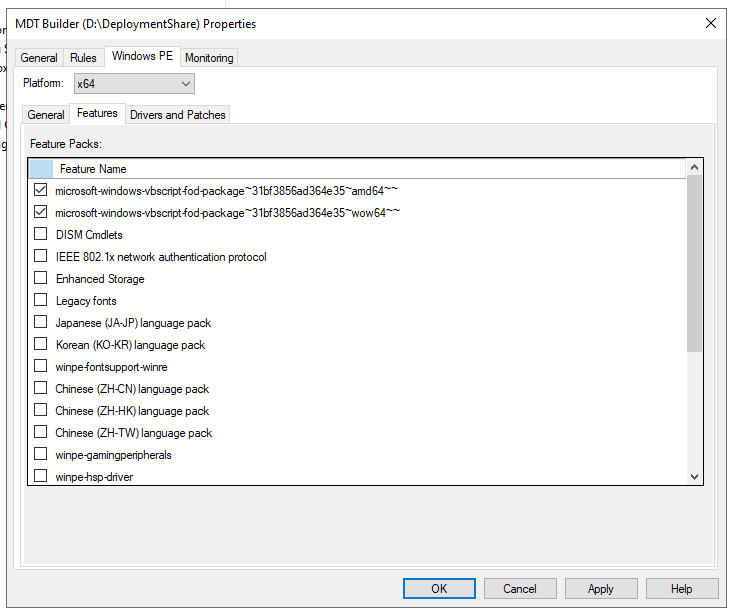

# Overview
Simple patch script to fix the `ADK 10.1.25398.1 missing VBScript issue.

## Script Use

> [!NOTE]
> This script needs to run as Administrator

Clone the repo to the server:
```
git clone https://github.com/smoonlee/adk-patch-2023.git
```

Set Execution Policy for PowerShell

``` powershell
Set-ExecutionPolicy -Scope 'CurrentUser' -ExecutionPolicy Unrestricted
```

Execute Patch Script

```powershell
 .\Patch-VBScriptFoD.ps1
```

Then head to Microsoft Deployment Toolkit. \
From the `Actions` pane, select `Properties` then `Windows PE`. \
Ensure the `Platform` is `amd64` and select `Features` and enable:

[x] `microsoft-windows-vbscript-fod-package~31bf3856ad364e35~amd64` \
[x] `microsoft-windows-vbscript-fod-package~31bf3856ad364e35~wow64`



Once this is done, Go back to `Actions` and `Update Deployment Share`.

``` powershell
Import-Module "C:\Program Files\Microsoft Deployment Toolkit\bin\MicrosoftDeploymentToolkit.psd1"
New-PSDrive -Name "DS001" -PSProvider MDTProvider -Root "D:\DeploymentShare"
update-MDTDeploymentShare -path "DS001:" -Force -Verbose
Remove-PSDrive -Name "DS001"
```
